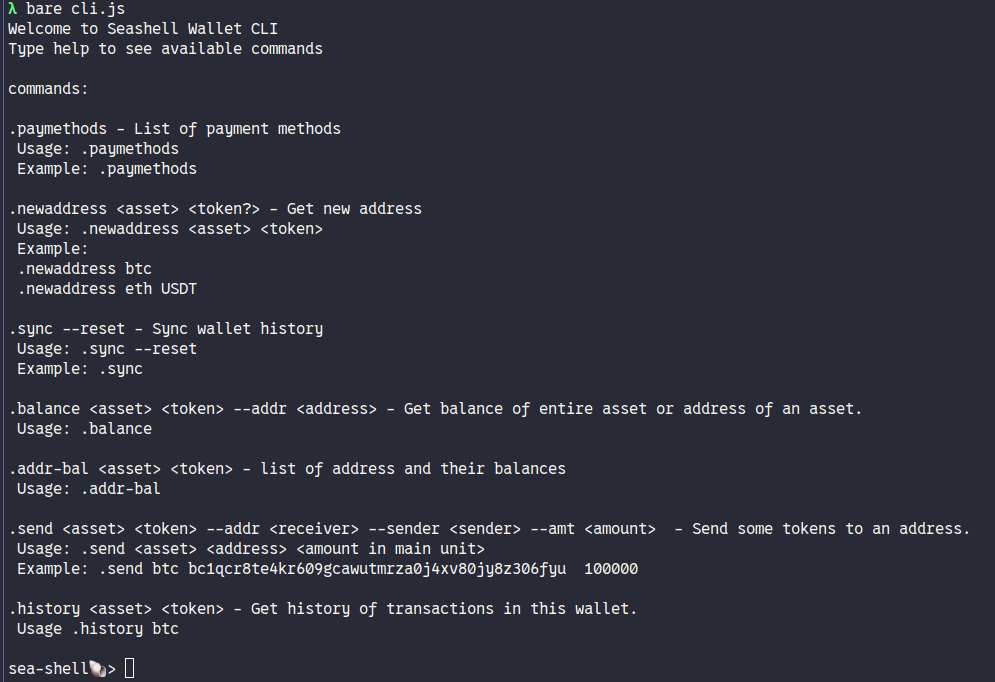

# Seashell CLI Wallet  Application

The wallet library comes with an example wallet running on 3 platforms

- [Node.js](https://nodejs.org/)
- [Bare runtime](https://github.com/holepunchto/bare) 
- [Web (Webpack)](https://webpack.js.org/)
